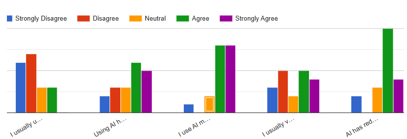

**AI Reliance and Perceived Technology Dependence Among Secondary-School
Students: A Case Study of NIS Karaganda, Kazakhstan**

Azat Zarukul

*Global Perspectives and Project Work*

Nazarbayev Intellectual School, Karaganda, Kazakhstan

May 2026

# Abstract

Generative artificial intelligence (AI) tools are increasingly embedded
in students’ academic routines, but their educational impact depends on
how they are used. This exploratory case study examines AI use,
perceived technology reliance, independent learning, verification
behavior, and critical thinking among secondary-school students at
Nazarbayev Intellectual School (NIS) Karaganda. An anonymous
cross-sectional survey collected responses from 159 students using
multiple-choice items, five-point Likert statements, and open-ended
questions. Descriptive response patterns were interpreted alongside a
thematic analysis of students’ written comments. The source manuscript
reports widespread use of AI tools. The available Likert chart
illustrates possible habitual and stress-related use and mixed
verification practices, although item-level response counts cannot be
confirmed from the document. Open-ended responses reveal a dual pattern:
students value AI for speed, clarification, and time-saving, but some
also report reduced effort and greater reliance on ready-made answers.
The study supports practical AI literacy and learning activities that
preserve independent reasoning. Because it is localized, voluntary,
self-reported, and cross-sectional, the findings are exploratory rather
than representative of all adolescents in Kazakhstan; they do not
establish causal effects on critical thinking.

**Keywords:** generative AI, AI reliance, technology dependence,
critical thinking, cognitive offloading, AI literacy, Kazakhstan,
secondary education

# 1. Introduction

## 1.1 Background

Generative AI has become a routine part of learning for many students.
In the United Kingdom, the Higher Education Policy Institute’s 2025
survey reported that 92% of surveyed undergraduates had used some form
of AI and 88% had used generative AI for assessment-related activities
(Freeman, 2025). These figures describe university students rather than
Kazakhstani adolescents, but they illustrate how quickly AI-supported
learning has become mainstream. At a broader international level,
UNESCO-UNEVOC (2025) reported that 62% of young respondents across 128
countries were already using AI in real-world contexts, while only 30%
had received formal AI training.

The educational issue is therefore not simply whether students use AI,
but how they use it. Generative systems can explain concepts, summarize
information, suggest ideas, and support writing; however, they can also
make it easy to delegate parts of the reasoning process. Research on
problematic AI use has linked reliance to academic stress, performance
expectations, cognitive offloading, and uncritical acceptance of
algorithmic output (Gerlich, 2025; Zhang et al., 2024). At the same
time, other work shows that structured human-AI collaboration can
support learning when students remain actively engaged in evaluation and
reasoning (Nasr et al., 2025; Zakaria et al., 2025).

Research focused specifically on secondary-school students in Kazakhstan
remains limited. A local case study can therefore contribute useful
exploratory evidence about students’ habits, perceptions, and concerns,
while avoiding the stronger claim that one school represents the entire
country.

## 1.2 Problem statement

AI tools can reduce the time and effort needed to complete academic
tasks. This efficiency is useful, but it may become problematic when
students begin to use AI before attempting a task independently, accept
generated answers without checking them, or rely on AI during periods of
academic stress. Zhang et al. (2024), in a study of university students,
found that academic stress and performance expectations were associated
with AI dependency. Gerlich (2025) similarly reported a relationship
between frequent AI use, cognitive offloading, and lower
critical-thinking performance in a broader mixed-method sample.

These studies do not establish that AI use automatically harms learning,
and their populations differ from the students examined in this project.
Nevertheless, they identify mechanisms worth exploring in a school
context: habit formation, stress-related use, verification behavior, and
perceived changes in independent thinking.

## 1.3 Purpose and research question

The purpose of this study is to explore how secondary-school students at
NIS Karaganda use generative AI and how they perceive its relationship
with technology reliance, independent learning, and critical thinking.

Research question: How do students at NIS Karaganda use generative AI,
and what patterns of self-reported reliance, verification, independent
learning, and critical thinking are associated with that use?

## 1.4 Objectives

1\. Document common academic uses of AI tools among participating
students.

2\. Examine self-reported patterns of habitual AI use, stress-related
use, verification, and independent problem-solving.

3\. Identify factors that students associate with greater reliance on
AI, including convenience and academic pressure.

4\. Explore perceived benefits and drawbacks of AI use through
open-ended responses.

5\. Develop practical implications for responsible AI use in school
settings.

## 1.5 Significance and scope

This study provides a localized snapshot of how students in one
academically selective school interact with generative AI. Its value
lies in documenting student perspectives and identifying questions for
future research, not in estimating national prevalence. The study
focuses on school-related and everyday uses of AI and on students’ own
perceptions of their behavior. It does not diagnose technology
addiction, measure long-term cognitive change, or establish that AI use
causes changes in critical thinking.

# 2. Literature Review

## 2.1 Key concepts

In this report, generative AI refers to systems such as ChatGPT and
Gemini that can produce natural-language responses, explanations,
summaries, and other generated content. Large language models (LLMs) are
the underlying model class used by many of these systems.

AI reliance refers here to a pattern in which users increasingly
delegate academic or cognitive tasks to AI. The term is used
descriptively rather than clinically. The study does not use a validated
diagnostic scale and therefore does not treat “AI dependence” as a
medical or psychological diagnosis.

Cognitive offloading is the transfer of mental effort to an external
aid. External aids are not inherently harmful: calculators, notes,
search engines, and AI can all reduce unnecessary cognitive load. The
concern arises when offloading replaces rather than supports processes
that students are expected to learn, such as evaluating evidence,
generating arguments, or checking the accuracy of information (Gerlich,
2025).

Critical thinking is used in this paper to mean the ability to evaluate
information, compare evidence, question assumptions, and make reasoned
judgments rather than simply accept a generated answer.

## 2.2 Academic stress, habit, and problematic reliance

Zhang et al. (2024) examined problematic AI usage among 300 university
students and found that academic stress and performance expectations
played mediating roles in AI dependency. Their findings are relevant to
this project because they suggest that reliance may be partly
situational: students under pressure may value immediate, ready-made
assistance more strongly. However, their university sample and
correlational design limit direct generalization to secondary-school
students.

Gerlich (2025) linked frequent AI use with cognitive offloading and
lower critical-thinking performance in a mixed-method study of 666
participants. The study supports the idea that repeated delegation of
reasoning tasks can alter how people approach complex work. Again, the
relationship should be interpreted cautiously because correlation does
not demonstrate that AI use alone caused the measured differences.

## 2.3 Overreliance and verification

A central risk in AI-assisted work is overreliance: accepting a
recommendation because it comes from an AI system without adequately
evaluating whether it is correct. Buçinca et al. (2021) found that
cognitive-forcing interventions could reduce overreliance on AI-assisted
decisions by requiring users to engage more actively with
recommendations. More recently, Pitts et al. (2025) studied reliance
patterns during AI-assisted programming tasks and found that trust,
self-efficacy, literacy, and need for cognition were related to whether
students appropriately accepted or rejected AI suggestions.

These findings suggest that verification is a skill, not merely a
personal preference. Students need to know when an AI answer requires
external checking, how to compare it with reliable sources, and how to
recognize confident but incorrect output.

## 2.4 Potential cognitive effects

Kosmyna et al. (2025) compared essay writing under three conditions: LLM
assistance, search-engine use, and no external tool. Their EEG-based
study reported lower neural engagement and weaker recall-related
outcomes in the LLM-assisted condition than in the brain-only condition.
The experiment is notable because it moves beyond self-reported
attitudes; however, it was conducted with a small adult sample in a
controlled essay-writing task and should not be treated as proof that
ordinary school use of AI causes cognitive decline.

Tian and Zhang (2025) similarly reported that greater AI dependence
among university students was associated with lower critical thinking,
with cognitive fatigue acting as a partial mediator. These findings
strengthen the case for studying how and when students rely on AI, but
they still concern university populations rather than adolescents.

## 2.5 Benefits of structured human-AI collaboration

The literature does not support a simple “AI is harmful” conclusion.
Nasr et al. (2025) distinguished passive AI-directed use from human-AI
supported collaboration and found that outcomes depend on how learners
interact with the system. Zakaria et al. (2025), in a systematic review
of AI and critical thinking in ESL contexts, likewise concluded that AI
can support writing and critical-thinking processes while excessive
reliance may weaken independent learning.

The key distinction is therefore between substitution and support. AI
can be useful when it helps students generate alternatives, receive
feedback, or clarify difficult material while the student remains
responsible for the final reasoning. It becomes more concerning when the
tool replaces the reasoning process itself.

## 2.6 AI versus traditional web search

Traditional web search usually requires users to formulate queries,
compare multiple sources, judge credibility, and synthesize information.
LLMs can collapse several of these steps into a single fluent response.
This reduces friction and can improve accessibility, but it may also
remove opportunities for source comparison and evaluation. Kosmyna et
al. (2025) reported stronger neural connectivity in the search-engine
group than in the LLM group during their writing experiment, which
provides one reason to examine whether convenience changes students’
learning behavior.

This does not mean that search engines are automatically educationally
superior. Search can also be used passively, and AI can be used
reflectively. The relevant question is the degree of active cognitive
engagement required by the task design.

## 2.7 Research gap in Kazakhstan

The reviewed literature is dominated by university samples and studies
conducted outside Central Asia. Evidence focused on Kazakhstani
secondary-school students remains scarce. This project addresses that
gap at a small scale by documenting patterns within NIS Karaganda. The
case-study design cannot establish national trends, but it can generate
hypotheses and practical questions for broader multi-school research.

# 3. Methodology

## 3.1 Research design

The study is best described as an exploratory cross-sectional
mixed-methods survey. The instrument combines quantitative items
(multiple-choice questions and five-point Likert statements) with
qualitative open-ended questions. This design is more accurate than
describing the project as purely qualitative because the Results section
relies heavily on percentages and response distributions.

## 3.2 Research site and sampling

The research was conducted at Nazarbayev Intellectual School in
Karaganda, Kazakhstan. The final survey sample comprised 159 students.
Participants were recruited through convenience sampling because the
researcher had direct access to the school community. This approach made
data collection practical, but it limits generalizability: students at
one selective school may differ from students in other schools, regions,
or educational systems. The reported responses came from grades 9–12,
with 72% from grades 11–12 according to the source manuscript.

## 3.3 Survey instrument

The survey was administered through Google Forms. It asked about
frequency of AI use, commonly used tools, habitual use, stress-related
use, verification of AI-generated answers, and perceived effects on
independent thinking. Five Likert statements were included:

1\. “I usually use AI before trying to solve tasks independently.”  
2. “Using AI has become a habit in my daily academic work.”  
3. “I use AI more frequently when I feel stressed about deadlines,
exams, or grades.”  
4. “I usually verify AI-generated answers using other sources.”  
5. “AI has reduced the amount of independent thinking I do while
studying.”

The survey also included open-ended questions asking how AI had changed
the way students study or complete assignments and whether they believed
AI makes students more dependent on technology.

## 3.4 Procedure and analysis

The survey link was distributed electronically through the school’s
corporate communication system. Participation was voluntary. The final
sample size was 159. Quantitative items were summarized descriptively
where the source provided usable figures. Open-ended responses were
reviewed for recurring ideas and grouped into themes such as efficiency,
reduced effort, heavy reliance, and strategic use. The original response
export and item-level denominators were not available for this revision.

No inferential statistical test is reported in the source manuscript.
Accordingly, this revised version avoids claims of statistically
significant relationships between variables. Phrases such as “associated
with” or “suggests a pattern” are used only to describe the observed
self-reports.

## 3.5 Ethical considerations

The survey was described as anonymous and voluntary, and the manuscript
indicates that only limited demographic information was requested. No
names or direct personal identifiers were required for the analysis
presented here. Because the participants are school students and may
include minors, any future replication or formal publication should
document school approval and consent procedures explicitly.

## 3.6 Sample and figure handling

The final survey sample was confirmed as 159 students. The earlier
methodology stated a target of 261, and a limitations paragraph
mistakenly reported 73; neither describes the final response count. The
original Figure 1 and its percentages were identified as erroneous and
are excluded from this version. The remaining Likert chart is reproduced
as an illustration of response patterns, but its item-level denominators
cannot be checked without the Google Forms export. No probability-based
margin of error, confidence interval, or population representativeness
is claimed for this convenience sample.

# 4. Results

## 4.1 Reported academic use of AI

The source manuscript describes AI as a familiar aid for school
assignments, brainstorming, explanations, and saving time. It reports
ChatGPT as a frequently used tool. Because the first frequency chart was
erroneous, this version does not report its percentages or draw a
numerical conclusion about how often the full sample used AI. The survey
nevertheless provides a basis for examining how students describe their
academic habits and the perceived benefits and drawbacks of AI
assistance.

## 4.2 Habit, academic pressure, and verification

The five Likert statements concern initial attempts at solving tasks,
habitual use, academic pressure, verification, and perceived independent
thinking. The remaining chart displays varied responses rather than a
uniform attitude: some students report relying on AI as a habit or using
it under pressure, while others do not describe the same pattern.
Item-level denominators were not supplied, so the visual should not be
treated as a precise distribution for all 159 respondents.

Responses shown for checking AI-generated answers fall on different
sides of the scale. This makes verification a useful topic for further
investigation, but the chart alone does not establish the proportion of
the full sample that routinely checks AI output.

The item asking whether AI has reduced independent thinking records
students’ perceptions of their own behavior. It does not measure
cognitive ability or demonstrate a decline caused by AI use.

Figure 1. Likert-response patterns for five statements about AI use
(Figure 2 in the original manuscript; item-level denominators are
unavailable).

## 4.3 Open-ended themes

Responses to the question “How has AI changed the way you study or
complete assignments?” produced four recurring themes. The examples
below preserve the meaning of the original student comments while
organizing them into a clearer thematic structure.

| Illustrative response                                                                                                                                       | Category                           | Interpretation                                                                                                         |
|-------------------------------------------------------------------------------------------------------------------------------------------------------------|------------------------------------|------------------------------------------------------------------------------------------------------------------------|
| “Artificial intelligence has made learning faster and more convenient: it helps to immediately understand the topic, sort out mistakes and find solutions.” | Efficiency and simplified learning | AI is used to clarify topics, reduce confusion, and obtain help quickly.                                               |
| “I’ve become less productive.” / “I became lazy.”                                                                                                           | Reduced effort                     | Some students feel AI lowers motivation to work or think independently.                                                |
| “I rely more on AI than I come up with ideas on my own…” / “I rely on AI 100%.”                                                                             | Heavy reliance                     | Some students explicitly describe replacing independent idea generation with AI.                                       |
| “I use AI solely for general and basic work.” / “I use AI for low-priority tasks and save time for more important tasks.”                                   | Strategic use                      | Some students deliberately delegate lower-priority work while reserving effort for tasks they consider more important. |

*Table 1. Themes identified in responses to the open-ended question on
how AI has changed students’ study practices.*

## 4.4 Perceptions of technology dependence

The source manuscript states that respondents to the second open-ended
question generally believed AI can make students more dependent on
technology. Their explanations were not identical. Some described
reduced effort, “laziness,” or reliance on ready-made answers, while
others argued that AI simply removes low-value work and frees time for
more important tasks. This contrast reinforces the central finding of
the project: students distinguish between strategic assistance and
passive substitution, even when they disagree about where that boundary
should be drawn.

# 5. Discussion

## 5.1 A dual pattern: efficiency and reliance

The findings do not support a simple conclusion that AI is either
beneficial or harmful. Students describe clear practical benefits:
faster explanations, easier access to ideas, and time savings. At the
same time, several responses explicitly connect AI with reduced effort
or weaker independent idea generation. This dual pattern is consistent
with Nasr et al. (2025) and Zakaria et al. (2025), who emphasize that
outcomes depend on whether AI is used as a collaborative support or as a
substitute for thinking.

## 5.2 Academic stress as a trigger

The available Likert chart and open responses suggest that academic
pressure can be a context for AI use. This observation is consistent
with Zhang et al. (2024), who identified academic stress and performance
expectations as factors associated with problematic AI use among
university students. The present survey cannot estimate the strength of
this relationship or establish a causal mechanism.

## 5.3 Verification and AI literacy

The varied responses about checking AI output point to a practical
teaching question: do students know when and how to verify a generated
answer? Fluent AI output can sound convincing even when it is incomplete
or incorrect. Research on overreliance shows that structured prompts
requiring reflection can reduce uncritical acceptance (Buçinca et al.,
2021). Schools can teach routines for checking factual claims, tracing
sources, comparing alternatives, and explaining why a generated answer
is accepted.

## 5.4 What the study cannot claim

The survey does not demonstrate that AI caused a decline in students’
critical thinking. It measures self-reported habits and perceptions at
one point in time. Students who already struggle with motivation or
experience greater academic stress may also be more likely to use AI
intensively. Longitudinal or experimental designs would be required to
test causality. Similarly, the term “dependence” in this project should
be understood as self-reported reliance, not a clinical diagnosis.

# 6. Conclusion

## 6.1 Key findings

AI is part of the academic routines described in this study of 159
students. The responses suggest that some students use it habitually or
under academic pressure. Students describe varying verification habits
and, in some cases, a perceived reduction in independent thinking.
Open-ended responses show both benefits—speed, clarification, and
efficiency—and concerns, especially reduced effort and reliance on
ready-made output. The available manuscript does not permit precise
item-level rates to be recalculated.

The strongest conclusion is therefore not that AI itself causes
technology dependence, but that patterns of use matter. Strategic use
can support learning, while passive or unverified use may replace parts
of the reasoning process students are expected to develop.

## 6.2 Implications

Teachers can reduce passive reliance by designing tasks that require
students to show reasoning, compare sources, critique AI output, or
revise an AI-generated answer rather than simply submit it. Students
should be taught a practical verification routine: check important
factual claims, ask for sources, consult an independent source, and
explain the final answer in their own words. Schools can also clarify
when AI is permitted, when disclosure is required, and which learning
outcomes must be completed independently.

Parents can reinforce the same distinction outside school by focusing
less on banning AI and more on whether students can explain and defend
the work they produce.

## 6.3 Limitations

This study has several important limitations. First, it is a voluntary
convenience sample from one school, so its findings cannot be
generalized to all adolescents in Kazakhstan. Second, the survey relies
on self-report, which may be affected by memory, social desirability, or
different interpretations of terms such as ‘dependence’ and ‘critical
thinking.’ Third, the cross-sectional design cannot establish causal
effects or long-term change. Fourth, the manuscript does not report a
validated scale for AI dependence or an objective test of critical
thinking. Finally, the raw Google Forms export and item-level
denominators were not available for this revision; the remaining chart
and reported descriptive figures cannot be independently recalculated
from the document alone.

## 6.4 Further research

Future work should include several schools from different regions and
school types, use a clearly documented sampling frame, and retain an
anonymized data dictionary and response count. Longitudinal research
could test whether reliance changes over time, while experimental tasks
could compare unaided work, search-engine use, and AI-assisted work
under controlled conditions. Future studies should also measure AI
literacy and critical thinking with validated instruments and examine
whether structured verification prompts reduce inappropriate reliance.
Interviews with students, teachers, and parents could add context that a
survey alone cannot capture.

## Data availability

Raw survey responses were not included in the materials provided for
this revision and are not included in this repository bundle. The
remaining figure is reproduced from the original manuscript with its
item-level denominator unverified. Any future public release of
response-level data should remove identifying information and comply
with school and participant-consent requirements.

# References

Buçinca, Z., Malaya, M. B., & Gajos, K. Z. (2021). To trust or to think:
Cognitive forcing functions can reduce overreliance on AI in AI-assisted
decision-making. Proceedings of the ACM on Human-Computer Interaction,
5(CSCW1), Article 188, 1–21. https://doi.org/10.1145/3449287

Freeman, J. (2025). Student Generative AI Survey 2025 (HEPI Policy Note
61). Higher Education Policy Institute.
https://www.hepi.ac.uk/reports/student-generative-ai-survey-2025/

Gerlich, M. (2025). AI tools in society: Impacts on cognitive offloading
and the future of critical thinking. Societies, 15(1), 6.
https://doi.org/10.3390/soc15010006

Kosmyna, N., Hauptmann, E., Yuan, Y. T., Situ, J., Liao, X.-H.,
Beresnitzky, A. V., Braunstein, I., & Maes, P. (2025). Your brain on
ChatGPT: Accumulation of cognitive debt when using an AI assistant for
essay writing task. arXiv. https://doi.org/10.48550/arXiv.2506.08872

Logg, J. M., Minson, J. A., & Moore, D. A. (2019). Algorithm
appreciation: People prefer algorithmic to human judgment.
Organizational Behavior and Human Decision Processes, 151, 90–103.
https://doi.org/10.1016/j.obhdp.2018.12.005

Nasr, N. R., Tu, C.-H., Werner, J., Bauer, T., Yen, C.-J., &
Sujo-Montes, L. (2025). Exploring the impact of generative AI ChatGPT on
critical thinking in higher education: Passive AI-directed use or
human–AI supported collaboration? Education Sciences, 15(9), 1198.
https://doi.org/10.3390/educsci15091198

Pitts, G., Rani, N., Mildort, W., & Cook, E.-M. (2025). Students’
reliance on AI in higher education: Identifying contributing factors.
arXiv. https://arxiv.org/abs/2506.13845

Tian, J., & Zhang, R. (2025). Learners’ AI dependence and critical
thinking: The psychological mechanism of fatigue and the social
buffering role of AI literacy. Acta Psychologica, 260, 105725.
https://doi.org/10.1016/j.actpsy.2025.105725

UNESCO-UNEVOC. (2025). Youth survey report on AI and digital skills:
World Youth Skills Day 2025.
https://unevoc.unesco.org/pub/wysd_survey_report_2025.pdf

Zakaria, N. Y. K., Hashim, H., & Jamaludin, K. A. (2025). Exploring the
impact of AI on critical thinking development in ESL: A systematic
literature review. Arab World English Journal, Special Issue on
Artificial Intelligence, 330–347. https://doi.org/10.24093/awej/AI.19

Zhang, S., Zhao, X., Zhou, T., & Kim, J. H. (2024). Do you have AI
dependency? The roles of academic self-efficacy, academic stress, and
performance expectations on problematic AI usage behavior. International
Journal of Educational Technology in Higher Education, 21, 34.
https://doi.org/10.1186/s41239-024-00467-0
